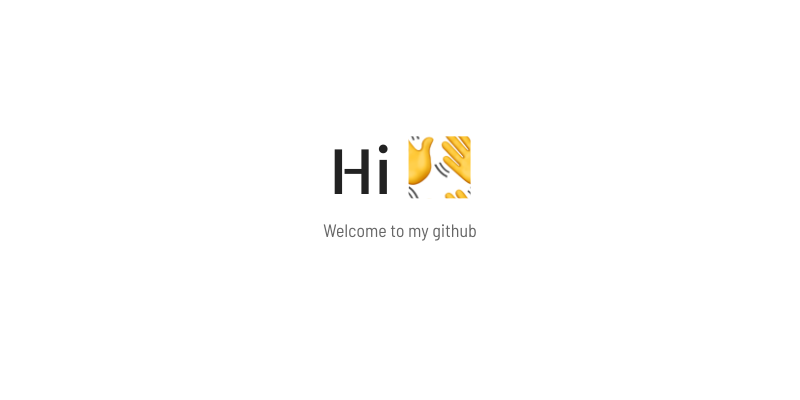
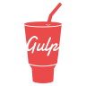

<!-- greeting image -->

 

 

### 
I'm Mahdi, Frontend Developer In 🇮🇷  
 

 

----------

 

👩‍💻 I'm currently working on [SDStudio](https://sdstudio.io/)

🧠 I'm currently learning Docker

💬 Ask me about anything related to Javascript / VueJS

⚡️ Fun fact about me : "I Drink Tea Instead Coffee At Late Nights"

 

## My Skill 

<table>
<tr>
<td style="text-align:center;" valign="top" width="33%">

### Frontend

  

</td>

<td style="text-align:center;" valign="top" width="33%" >

### Backend  

</td>

<td style="text-align:center;" valign="top" width="33%">

### Tool's

  

</td>
</tr>
</table>

 

## Connect with me

